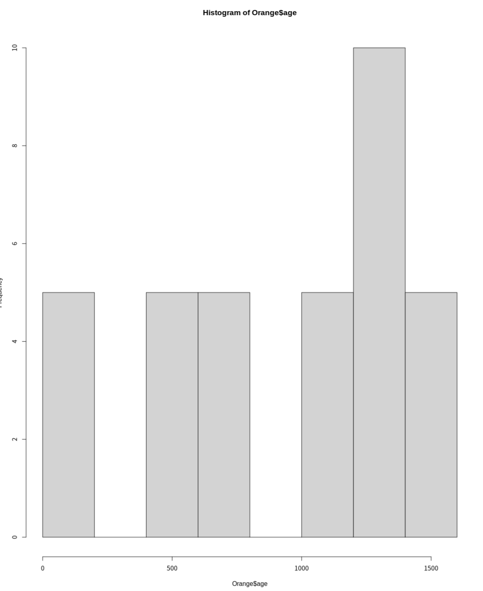
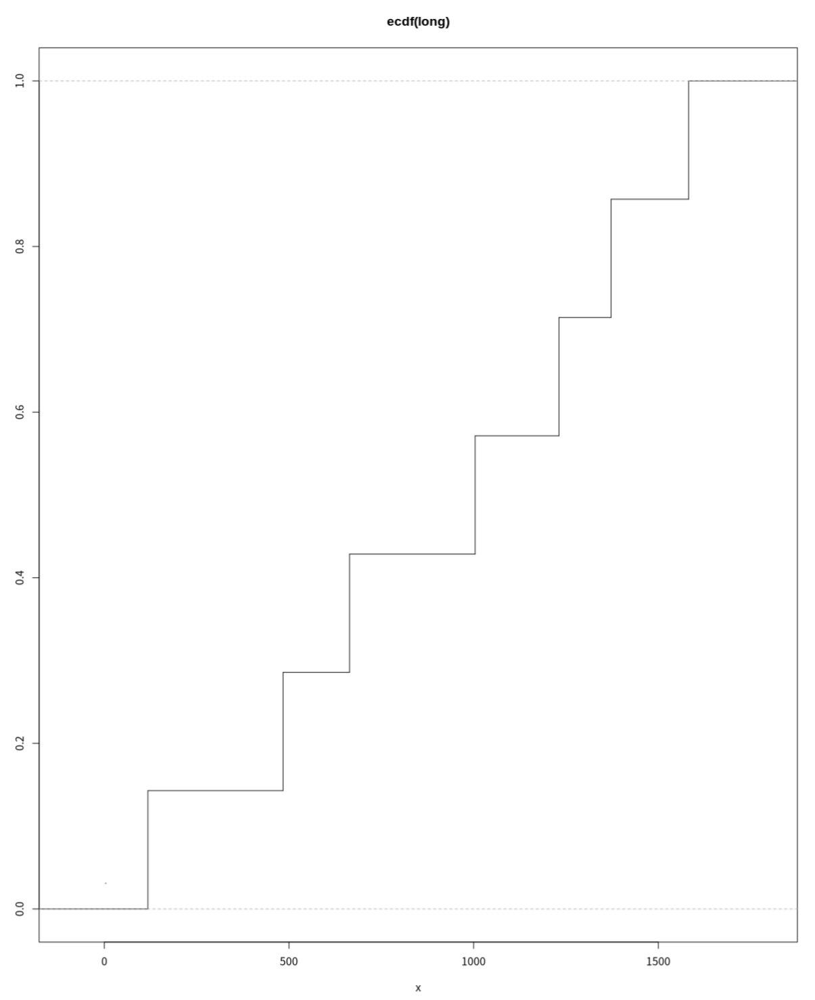
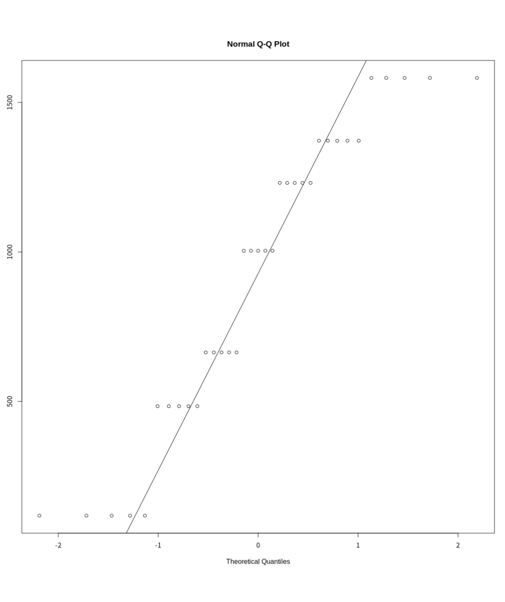

# 概率分布

## R作为一套统计表

R 为众多的概率分布提供了四类基本函数，其命名遵循特定的前缀规则

**前缀含义**：

- d：**概率密度函数 (density)**
- p：**累积分布函数 (CDF)**
- q：**分位数函数 (quantile)**
- r：**生成随机偏差（随机数，simulation）**

支持的常见分布：包括正态分布 (norm)、二项分布 (binom)、泊松分布 (pois)、指数分布 (exp)、t 分布 (t)、F 分布 (f)、卡方分布 (chisq)、均匀分布 (unif) 等 20 多种

参数控制：pxxx 和 qxxx 函数具有 lower.tail（选择下尾或上尾概率）和 log.p 参数；dxxx 函数具有 log 参数，可以直接获取对数似然值

```r
>  2*pt(-2.43, df = 13)
[1] 0.0303309
> qf(0.01, 2, 7, lower.tail = FALSE)
[1] 9.546578
```

```r
> data("Orange")
> attach("Orange")
> head(Orange)
  Tree  age circumference
1    1  118            30
2    1  484            58
3    1  664            87
4    1 1004           115
5    1 1231           120
6    1 1372           142
```

## 检验一组数据的分布情况

这一部分介绍了如何通过数值摘要和图形工具来探索单变量数据的分布特征：

数值摘要：

- **summary**：提供最小值、最大值、均值和四分位数。

```r
> summary(Orange)
 Tree       age         circumference
 3:7   Min.   : 118.0   Min.   : 30.0
 1:7   1st Qu.: 484.0   1st Qu.: 65.5
 5:7   Median :1004.0   Median :115.0
 2:7   Mean   : 922.1   Mean   :115.9
 4:7   3rd Qu.:1372.0   3rd Qu.:161.5
       Max.   :1582.0   Max.   :214.0
```

- **fivenum**：提供五数概括（Tukey 的五数摘要）。

```r
> fivenum(Orange$age)
[1]  118  484 1004 1372 1582
```

图形展示：

- **茎叶图 (stem)** ：展示数值的文本分布。

```r
> stem(Orange$age)

  The decimal point is 2 digit(s) to the right of the |

   0 | 22222
   2 |
   4 | 88888
   6 | 66666
   8 |
  10 | 00000
  12 | 3333377777
  14 | 88888
```

- **直方图 (hist)** ：最常用的分布可视化工具。



- **密度图 (density)** ：比直方图更平滑，常与 lines() 结合使用叠加在直方图上。


```r
> lines(density(Orange$age))
> rug(Orange$age) # 显示实际据点
```

- **经验累积分布图 (ecdf)** ：展示数据累积概率的步进函数。

```r
> attach(Orange)
> plot(ecdf(age), do.points=FALSE, verticals=TRUE)
> long <- age[age > 3]
> plot(ecdf(long), do.points=FALSE, verticals=TRUE)
> x <- seq(3, 5.4, 0.01)
> lines(x, pnorm(x, mean=mean(long), sd=sqrt(var(long))), lty=3)
```



- **Q-Q 图 (qqnorm, qqline, qqplot)** ：用于检查数据是否符合某种理论分布（如正态分布）。

```r
> par(pty="s")
> qqnorm(long); qqline(long)
> qqplot(qt(ppoints(250), df = 5), x, xlab = "Q-Q plot for t dsn")
> qqline(x)
> shapiro.test(long)
> > ks.test(long, "pnorm", mean = mean(long), sd = sqrt(var(long)))
```



正式正态性检验：

- **shapiro.test**：Shapiro-Wilk 正态性检验。
- **ks.test**：Kolmogorov-Smirnov 检验，用于比较观测分布与理论分布，或两个观测分布之间的差异。

## 单样本与双样本检验

这一部分介绍了比较两个样本或单样本与理论值之间差异的标准统计方法：

常见的操作是比较两个样本的某些方面。请注意，在 R语言中，所有“经典”检验（包括下面使用的检验）都包含在 stats 包中，该包通常会被加载。

- 可视化比较：使用箱线图 (boxplot) 直观对比两组数据的中位数和离散程度。
- 均值比较 (t 检验)：
  t.test：默认进行 Welch 修正的 t 检验（不假设方差相等）。
  可以通过设置 var.equal=TRUE 执行经典的学生 t 检验。
- 方差比较 (F 检验)：
  var.test：用于检验两个正态总体方差是否相等。
- 非参数检验：
  wilcox.test：Wilcoxon 秩和检验（曼-惠特尼检验），在不假设数据为正态分布时使用。
- 分布比较：
  双样本的 ks.test：通过计算两个经验累积分布函数之间的最大垂直距离来检验两样本是否来自同一连续分布。
